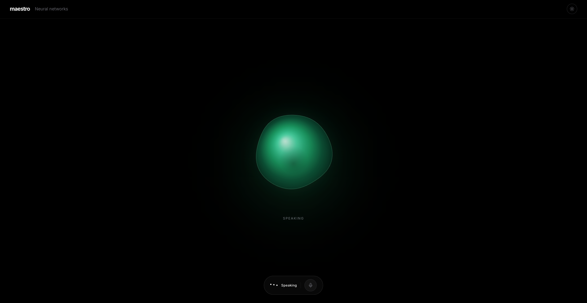
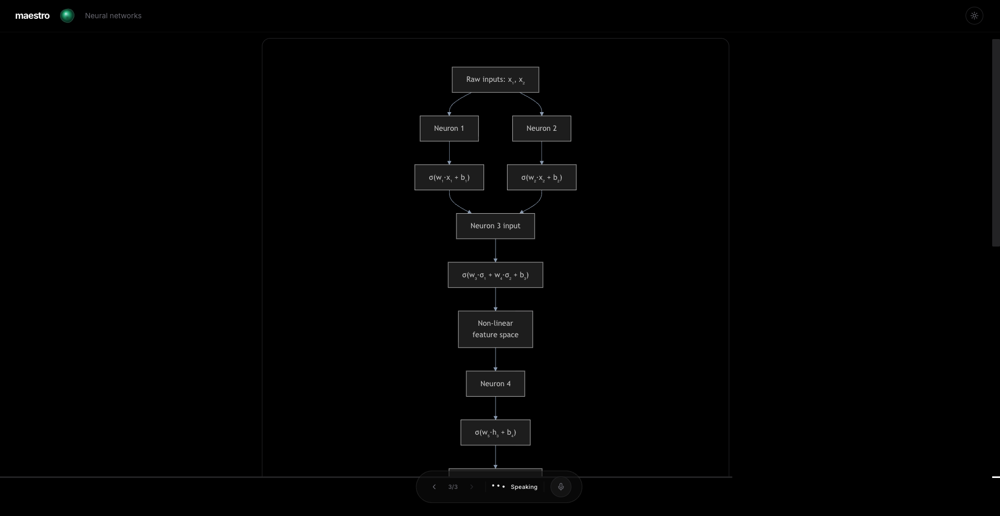
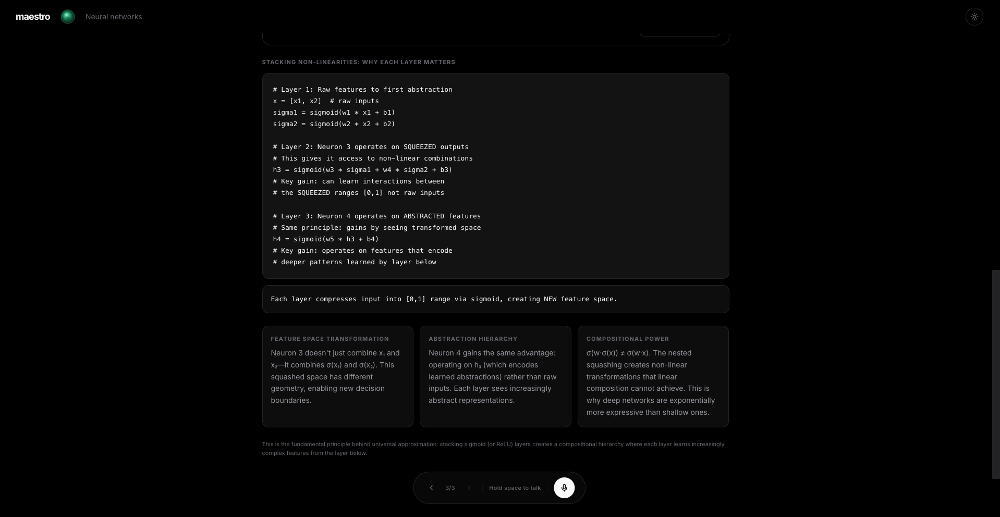

# 🎓 Maestro — Real-time Voice AI Tutor

Maestro is a production-grade, voice-based AI tutoring application. You speak to it, it thinks with a state-of-the-art LLM (Claude, Gemini, or Grok), and replies with a natural voice — all streamed in real-time over WebSockets. It also auto-generates interactive Mermaid.js diagrams to visually explain concepts and persists your learning journey in a MySQL database.

---

## ✨ Features

| Feature | Description |
|---|---|
| **Voice-First Interaction** | Record questions via the browser and receive spoken AI responses streamed back with ultra-low latency. |
| **Topic Curation** | Don't just pick a topic; Maestro curates a custom syllabus for you through a voice-based interview to understand your current knowledge and goals. |
| **multi-Provider Support** | Switch between top-tier AI providers: **Anthropic (Claude)**, **Google (Gemini)**, **xAI (Grok)**, **ElevenLabs**, and **Cartesia**. |
| **Socratic Tutoring** | The AI tutor uses scaffolding and the Socratic method — it guides you to the answer with hints and questions instead of just lecturing. |
| **Auto Visualisations** | After every response, a second LLM call generates interactive Mermaid.js charts (flowcharts, sequence diagrams, mind maps, etc.) to help you "see" the concepts. |
| **Persistence & Auth** | Full user authentication and session persistence. Your syllabuses, learning progress, and conversation history are saved to MySQL. |

---

## 📸 Screenshots

### Teaching Interface


### Visual Explanations


### Detailed Context


---

## 🏗️ Architecture

```
Next.js Frontend (localhost:3000)
    │
    │  WebSocket (Audio Chunks ↔ JSON Metadata + Audio)
    ▼
FastAPI Backend (localhost:8000)
    ├── Auth (JWT) & Persistence (MySQL/SQLModel)
    ├── STT — ElevenLabs / Cartesia / AssemblyAI
    ├── LLM — Claude-3.5-Sonnet / Gemini-1.5-Flash / Grok-Beta
    ├── TTS — ElevenLabs / Cartesia / Grok (Streaming)
    └── Visualiser — Mermaid.js Generation
```

### The Learning Flow

1. **Authentication**: Sign up and log in to keep your progress synced.
2. **Curation**: Start a new learning journey. Maestro will talk to you to figure out what you know and what you want to learn.
3. **Syllabus Generation**: Based on the interview, Maestro generates a multi-chapter syllabus stored in the database.
4. **Learning Session**: Enter a chapter. The tutor greets you and begins the Socratic teaching loop.
5. **Real-time Interaction**: Your voice is transcribed (STT), processed (LLM), and spoken back (TTS) chunk-by-chunk for a seamless experience.

---

## 🚀 Getting Started

### Prerequisites

- **Python 3.10+**
- **Node.js 18+** (and `npm` or `pnpm`)
- **MySQL 8.0+**
- **PortAudio** (for local audio utilities):
  ```bash
  # macOS
  brew install portaudio
  ```

### 1. Database Setup

Create a MySQL database named `maestro`:

```sql
CREATE DATABASE maestro;
```

Apply the schema and initial migrations:
```bash
# Apply the base tables
mysql -u root -p maestro < tables.sql

# Apply migrations
mysql -u root -p maestro < migrations/add_auth_columns.sql
mysql -u root -p maestro < migrations/add_user_id_to_syllabus.sql
```

### 2. Backend Setup

```bash
python -m venv venv
source venv/bin/activate
pip install -r requirements.txt
```

### 3. Frontend Setup

```bash
cd frontend
npm install
```

### 4. Configuration

Copy the example environment file and fill in your API keys:

```bash
cp .env.example .env
```

| Key | Description |
|---|---|
| `CLAUDE_CODE` | Anthropic API Key (Primary LLM) |
| `GEMINI_API_KEY` | Google AI API Key |
| `GROK_API_KEY` | xAI API Key |
| `ELEVEN_LABS` | ElevenLabs API Key (TTS/STT) |
| `CARTESIA_API_KEY` | Cartesia API Key (High-speed TTS) |
| `MYSQL_*` | Your database connection details |
| `JWT_SECRET_KEY` | A random string for securing sessions |

---

## 🏁 Running the Application

Start the **FastAPI Server**:
```bash
# From the root directory
uvicorn app.main:app --reload
```

Start the **Next.js Frontend**:
```bash
cd frontend
npm run dev
```

Visit **http://localhost:3000**, register an account, and click **"Start Learning"** to begin your first curated session.

---

## 🔧 Tech Stack

- **Backend**: FastAPI, SQLModel (SQLAlchemy), WebSockets, PyMySQL
- **Frontend**: Next.js 15+, TypeScript, Tailwind CSS, Framer Motion
- **AI/ML**:
  - **LLM**: Anthropic Claude 4.5, Gemini 2.5, Grok
  - **TTS**: ElevenLabs Flash, Cartesia Sonic, Grok Streaming
  - **STT**: ElevenLabs Scribe, AssemblyAI, Cartesia
- **Visuals**: Mermaid.js, SVG-Pan-Zoom

---

## 📄 License

This project is unlicensed. Add a license as needed.
